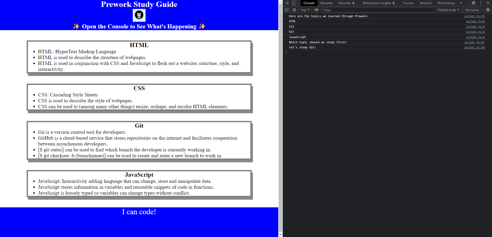

# <Prework Study Guide>

## Description

This is the Prework Study Guide. It's purpose is to act as a interactive place to store and study the concepts we learn through the course of this bootcamp.

## Table of Contents (Optional)

- [Installation](#installation)
- [Usage](#usage)
- [Credits](#credits)
- [License](#license)

## Installation

N/A

## Usage
 
Refer to the console for a studying suggestion!

## Credits

N/A
    
## License

Refer to the license in the repo.
---

## Features

Sections:

    - HTML
    - CSS
    - Git
    - JavaScript

## How to Contribute

Coming Soon...

## Tests

Coming Soon...